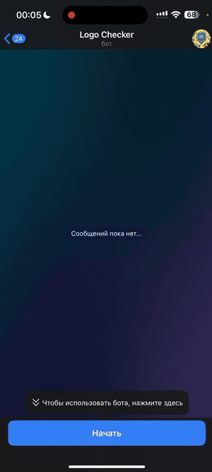
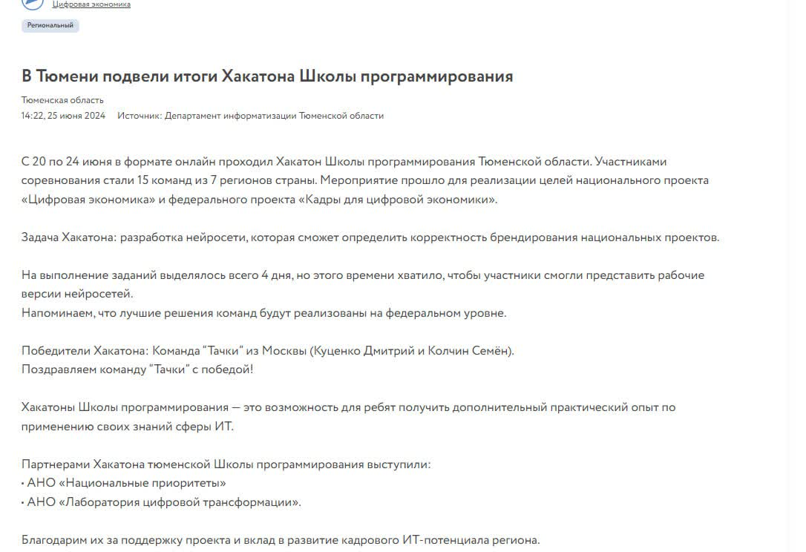
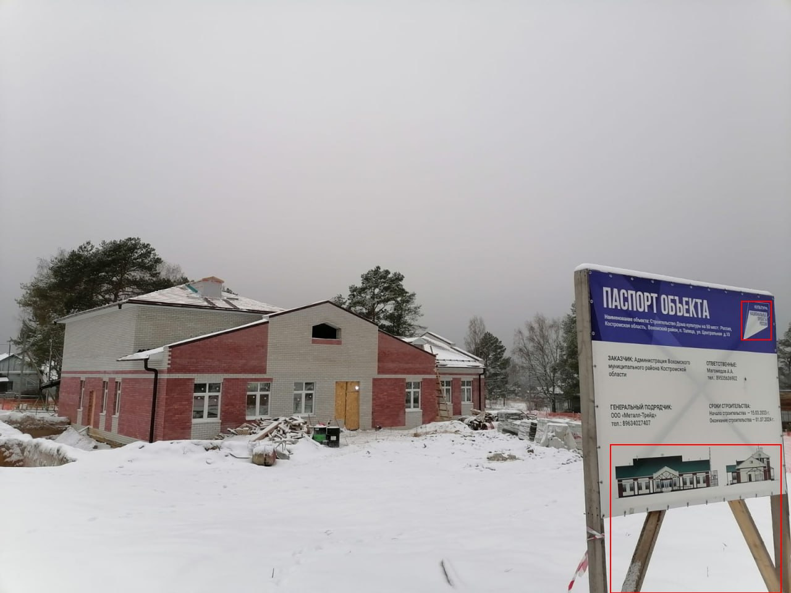
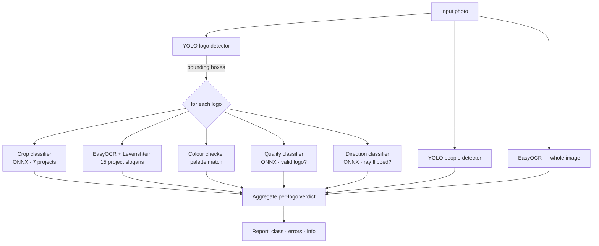

<div align="center">

# 🎯 Logo Error Checker

**A multi-model computer-vision pipeline that verifies the branding of Russian "National Projects" on photos — detects logos, classifies the project, reads the slogan, checks colour and orientation, and flags people in frame — served over a Telegram bot, a REST API and a Streamlit UI.**

[](https://www.python.org/)
[](https://fastapi.tiangolo.com/)
[](https://docs.aiogram.dev/)
[](https://streamlit.io/)
[](https://docs.ultralytics.com/)
[](https://onnxruntime.ai/)
[](LICENSE)
[](https://contenta.info/press_releases/788976)

[Quick Start](#-quick-start) · [How It Works](#️-how-it-works) · [Models](#-the-models) · [API](#-rest-api) · [Weights](#-model-weights) · [Docs](#-documentation)

<br/>



<sub>The Telegram bot in action — pick an object, send a photo, get a per-logo verdict.</sub>

</div>

---

## 🚀 What is Logo Error Checker?

Russia's federal **National Projects** (`Национальные проекты`) come with a strict visual-branding guideline — a specific "ray" logo, per-project colour palettes, an approved font, correct logo orientation, and a rule that no people appear in official object photos. Verifying that thousands of submitted photos follow these rules by hand is slow.

**Logo Error Checker** automates that review. You send a photo; the system detects every logo, figures out which National Project it belongs to (by reading the text, by colour, and by a trained classifier), and returns a per-logo report of what's right and what's wrong — wrong orientation, mismatched colours, a logo that's too small/far, or people in the frame.

> 🏆 **1st place** at the **Tyumen Region School-of-Programming Hackathon** (June 2024 · 15 teams from 7 regions) — built for the *"Branding of National Projects"* case of the **«Цифровая экономика»** national programme.

<div align="center">
<a href="https://contenta.info/press_releases/788976">

</a>
<br/>
<sub>📰 Press coverage of the results — <a href="https://contenta.info/press_releases/788976">contenta.info</a></sub>
</div>

## 🎬 In action

Send a photo of a national-project object; the bot returns a structured, **per-logo verdict** — detected project class, technique errors, OCR of the slogan and a colour-palette match — and archives accepted photos to Yandex Disk.



**Example verdicts the system produces:**

- **Logo 1** → class `culture`, no errors; palette matches *international cooperation* 26.9%, *culture* 25.7%
- **Logo 2** → ⚠️ *wrong orientation / ray distortion*; too small to OCR; palette weakly matches *urban environment*, *healthcare*
- *“Couldn't read the logo text; strongly resembles the **ecology** class; palette matches ecology, science & universities.”*

Every verdict is fully **interpretable** — each error maps to an explicit geometry / colour / OCR check, not a black-box score.

<br clear="all"/>

## ⚡ Quick Start

```bash
git clone https://github.com/simeonkolchin/logo-error-checker.git
cd logo-error-checker

python -m venv .venv && source .venv/bin/activate
pip install -r requirements.txt

cp .env.example .env          # add your Telegram + Yandex Disk tokens
```

> ⚠️ **Model weights are not in this repo** — the `app/ml/weights/` directory ships empty. See [Model weights](#-model-weights) before running anything that loads a model.

Run any of the three interfaces from the repo root:

```bash
# REST API (FastAPI + Uvicorn)
uvicorn app.api.api:app --host 0.0.0.0 --port 8000

# Streamlit web UI
streamlit run app/ui/layout.py

# Telegram bot (requires TELEGRAM_BOT_TOKEN in the environment)
PYTHONPATH=. python app/bot/telegram_bot.py
```

Or with Docker (serves the API):

```bash
docker build -t logo-error-checker .
docker run --rm -p 8000:8000 --env-file .env \
  -v "$PWD/app/ml/weights:/app/app/ml/weights" logo-error-checker
```

## 🏗️ How It Works



Orchestration lives in [`app/ml/ml.py`](app/ml/ml.py) (`LogoErrorChecker.check_errors`). It detects logos, then for each crop runs the classifiers and combines their outputs into a verdict: the project class (cross-checked between OCR text, colour and the crop classifier), plus human-readable errors and info strings.

## 🧠 The Models

| Model | File | Backend | Role |
|---|---|---|---|
| Logo detector | `logo_detector.py` | YOLO (`.pt`) + NMS | Find logo bounding boxes |
| People search | `search_people.py` | YOLO (`.pt`) | Flag any person in the frame |
| Crop classifier | `classification_crop.py` | ONNX | Classify a cropped logo into 7 projects |
| Direction classifier | `classification_direction.py` | ONNX | Detect a flipped/distorted "ray" |
| Quality classifier | `classification_check_good.py` | ONNX | Is this a valid logo at all? |
| OCR + text match | `ocr.py` | EasyOCR + Levenshtein | Read the slogan, match to 15 project names |
| Colour checker | `color_checker.py` | NumPy palette match | Match pixels to per-project colours |

The detection rules combined in `ml.py` include: logo occupying < ~1 % of the photo (too far/small), invalid logo, flipped ray / distortion, and OCR-vs-colour disagreement.

## 🔌 Interfaces

| Interface | Entry point | Notes |
|---|---|---|
| REST API | `app/api/api.py` (`app.api.api:app`) | `POST /check_errors/` with an image file |
| Telegram bot | `app/bot/telegram_bot.py` | aiogram FSM; stores results in SQLite + uploads to Yandex Disk |
| Streamlit UI | `app/ui/layout.py` | Upload an image, see annotated result |

## 📡 REST API

**`POST /check_errors/`** — multipart form field `file` (an image).

```bash
curl -X POST "http://localhost:8000/check_errors/" -F "file=@example.jpg"
```

```python
import requests

with open("example.jpg", "rb") as f:
    r = requests.post("http://localhost:8000/check_errors/", files={"file": f})
print(r.json())
```

Response shape:

```json
{
  "full_ocr_class": ["образование", 0.12],
  "people": false,
  "bbox_results": [
    {
      "bbox": [36, 2, 313, 246],
      "errors": ["Неправильное направление или искажение логотипа"],
      "info": ["Логотип класса: образование", "Цветовая палитра совпадает с ..."],
      "class": "образование"
    }
  ]
}
```

## 📦 Model weights

The five trained weight files are **not committed** (`app/ml/weights/` contains only a `.gitkeep`). You must place them there before running:

```
app/ml/weights/
├── logo_detector.pt                 # YOLO logo detector
├── search_people.pt                 # YOLO people detector
├── classification_crop.onnx         # crop → project classifier
├── classification_direction.onnx    # ray-direction classifier
└── classification_check_good.onnx   # logo validity classifier
```

How to obtain them:

- **Download from the [release](https://github.com/simeonkolchin/logo-error-checker/releases/tag/weights-v1)** — `classification_check_good.onnx` is published there.
- **Train them yourself** — the notebooks in [`train/`](train/) reproduce every model (`yolo_train.ipynb` for detection, `train/classification/*.ipynb` for the ONNX classifiers, `ocr.ipynb` for the OCR pipeline). Export the classifiers to ONNX and YOLO models to `.pt`.
- **Request the remaining pre-trained weights** from the maintainer (see [Contact](#-contact)).

File names must match exactly, or override the paths via the `LogoErrorChecker(...)` constructor arguments.

## ⚙️ Configuration

All secrets are read from the environment (see [`.env.example`](.env.example)).

| Variable | Used by | Description |
|---|---|---|
| `TELEGRAM_BOT_TOKEN` | Telegram bot | Bot token from [@BotFather](https://t.me/BotFather) |
| `YANDEX_DISK_TOKEN` | Telegram bot | Yandex Disk OAuth token for archiving accepted photos |

## 📚 Documentation

- [Getting Started](docs/getting-started.md)
- [Architecture](docs/architecture.md)

## 🛡️ Security

Secrets are read only from the environment; `.env` is gitignored and `.env.example` ships placeholders. See [SECURITY.md](SECURITY.md).

## 🗺️ Roadmap

- [ ] Publish downloadable pre-trained weights
- [ ] Font (Roboto) compliance check
- [ ] English localisation of report strings
- [ ] Batch endpoint for multiple photos
- [ ] GPU inference toggle for EasyOCR / YOLO

## 🧑‍💻 Contributing

Contributions welcome — see [CONTRIBUTING.md](CONTRIBUTING.md).

## 📬 Contact

Questions or the case brief: [simeonkolchin@gmail.com](mailto:simeonkolchin@gmail.com).

## 📄 License

MIT © [Simeon Kolchin](https://github.com/simeonkolchin)
