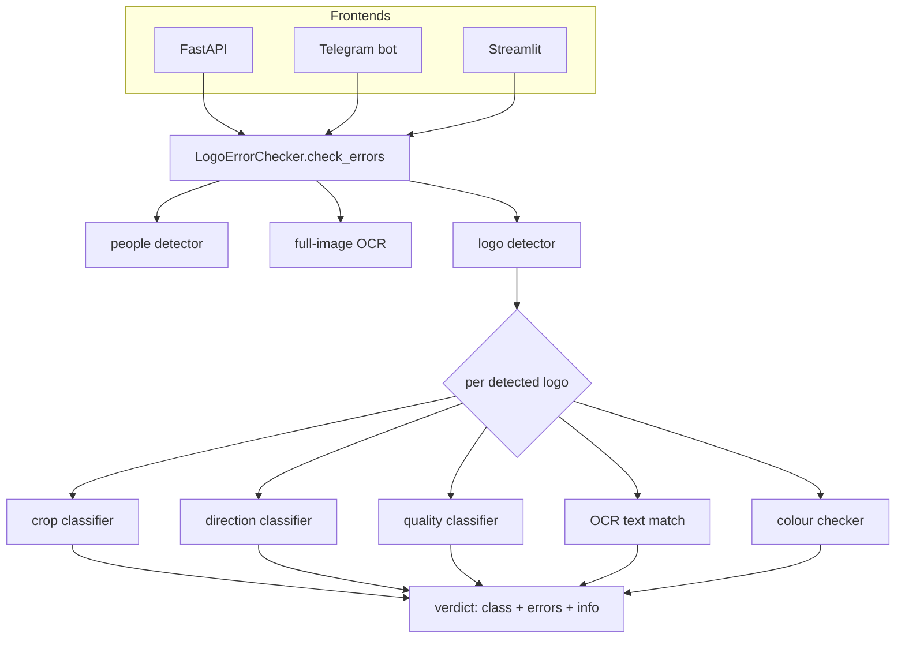
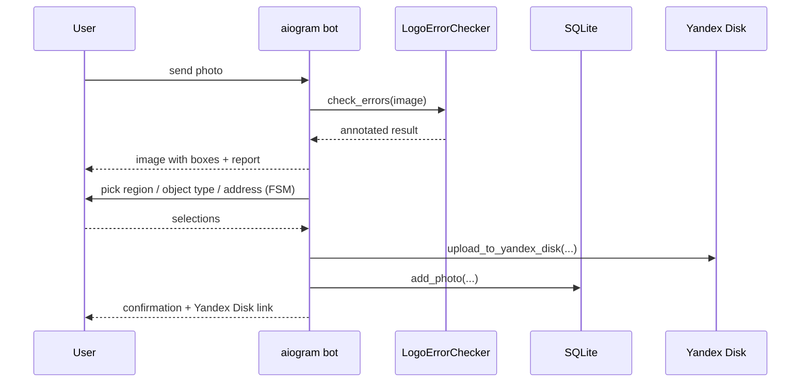

# Architecture

Logo Error Checker is a computer-vision pipeline with three interchangeable front ends.

## Layout

```
app/
├── api/api.py          # FastAPI app — POST /check_errors/
├── bot/
│   ├── telegram_bot.py # aiogram FSM bot
│   ├── yandex_disk.py  # upload accepted photos to Yandex Disk
│   └── sql_lite.py     # SQLite persistence of accepted photos
├── ui/layout.py        # Streamlit upload UI
└── ml/
    ├── ml.py                        # LogoErrorChecker — orchestration
    ├── logo_detector.py             # YOLO logo detection + NMS
    ├── search_people.py             # YOLO person detection
    ├── classification_crop.py       # ONNX 7-class project classifier
    ├── classification_direction.py  # ONNX ray-direction classifier
    ├── classification_check_good.py # ONNX logo-validity classifier
    ├── ocr.py                       # EasyOCR + Levenshtein text matcher
    ├── color_checker.py             # NumPy palette matcher
    └── weights/                     # (not committed) .pt / .onnx files
train/                  # Jupyter notebooks that reproduce every model
data/                   # dataset layout (images not committed)
```

All three front ends construct a single `LogoErrorChecker` and call `check_errors(image)`.

## The pipeline



## How a verdict is formed (`ml.py`)

For each detected logo crop, `check_errors` gathers signals and applies rules:

- **Size** — normalised box area < 0.007 → "logo too small / too far".
- **Validity** — quality classifier output < 0 → "invalid logo".
- **Direction** — direction classifier output < 0 (except for the *safe quality roads* project) → "flipped ray / distortion".
- **Class** — resolved by cross-referencing three sources: OCR text (Levenshtein-matched to 15 project slogans), colour-palette match, and the crop classifier. Agreement between OCR text and colour raises confidence; disagreement is reported.
- **People** — a separate YOLO pass flags any person in the whole image.

The result is a dict: `{ full_ocr_class, people, bbox_results: [{ bbox, errors, info, class }] }`.

## Telegram bot flow



The bot uses an FSM (`waiting_for_region` → `waiting_for_object_type` → `waiting_for_address`) driven by an Excel catalogue of Tyumen-region branding objects, then persists accepted photos.

## Training

Every model is reproducible from `train/`: `yolo_train.ipynb` (detection), `train/classification/train_{crop,direction,check_good}.ipynb` (ONNX classifiers), and `ocr.ipynb` (OCR pipeline). The `data/*/data.yaml` files describe the detection datasets and class names.

## Notes

- Classifiers run on **ONNX Runtime**; detectors run on **Ultralytics YOLO**. This keeps inference light and dependency-flexible.
- OCR is Russian-language EasyOCR; text is matched to project slogans by normalised Levenshtein distance.
